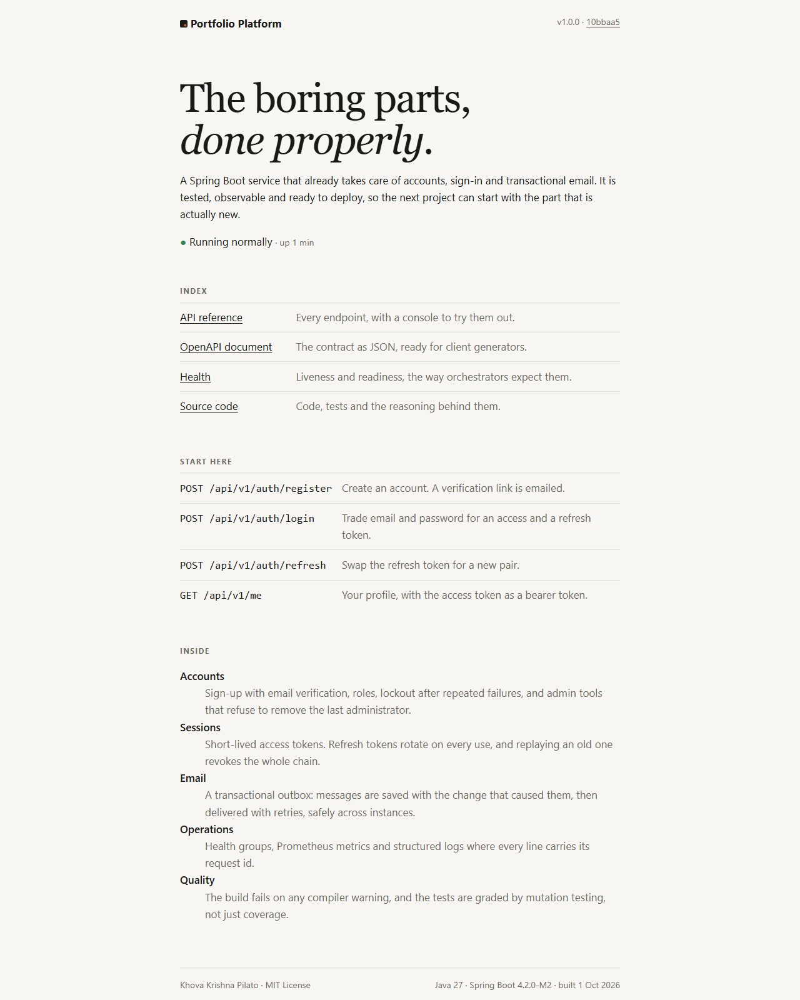
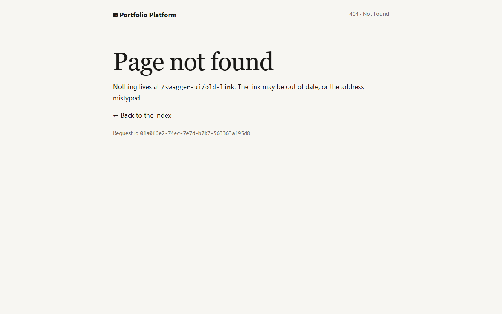
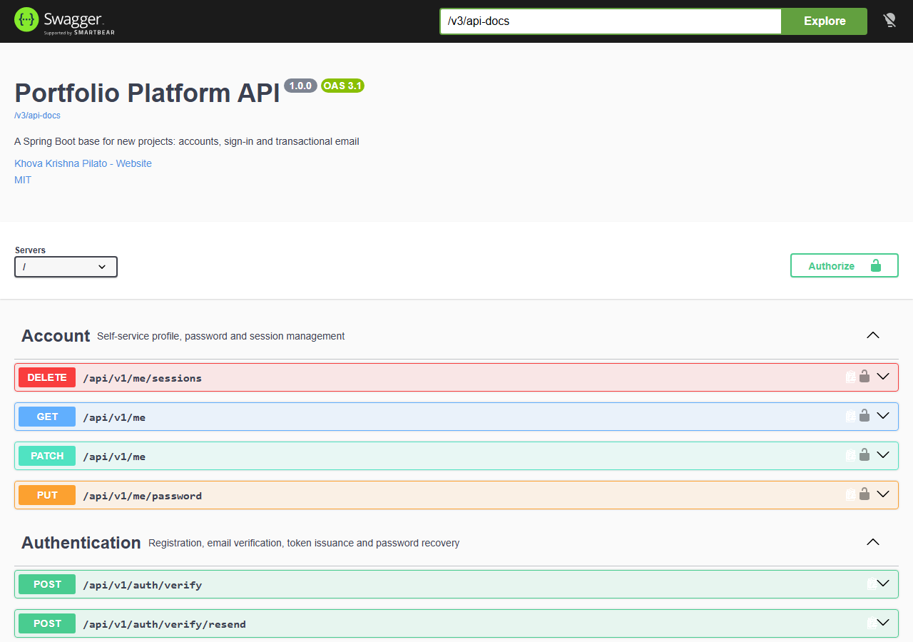
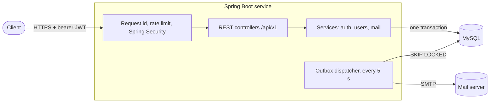
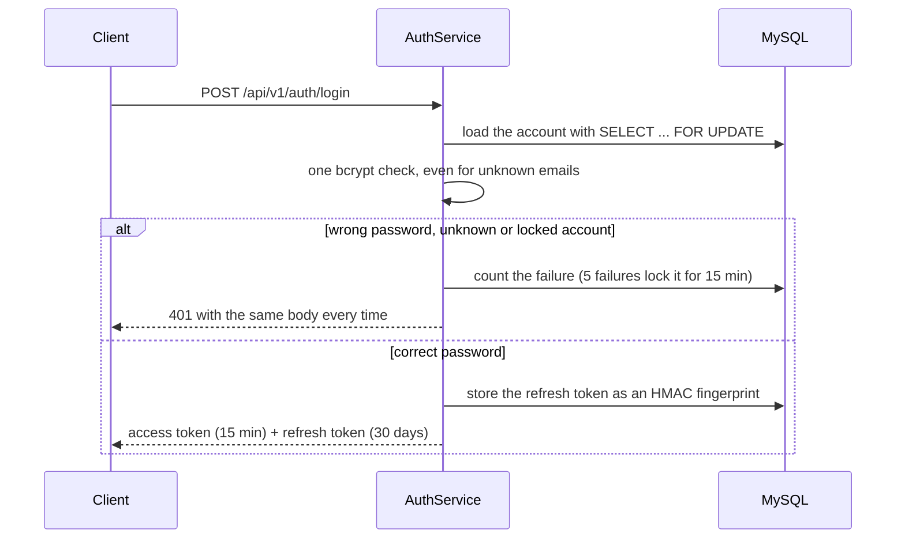
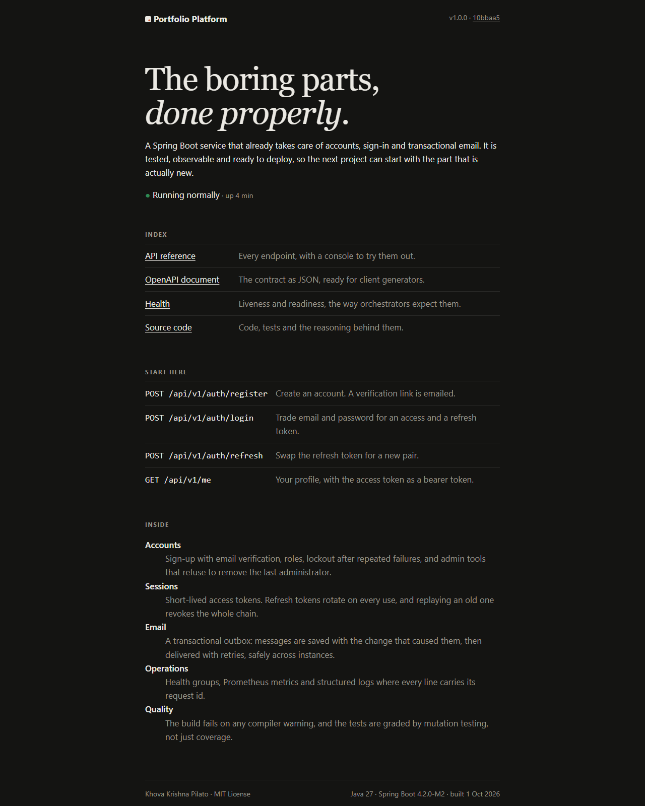

<div align="center">

# Portfolio Platform

**The boring parts, done properly.**

A Spring Boot service that already handles accounts, sign-in and transactional email,<br>
so the next project can start with the part that is actually new.

[](https://github.com/krishnapilato/portfolio/actions/workflows/backend.yml)




</div>

<p align="center">
  
  
</p>

---

**Contents** · [What's inside](#whats-inside) · [Quick start](#quick-start) · [Architecture](#architecture) · [Security](#security) · [Configuration](#configuration) · [Quality](#quality) · [API](#api) · [Design decisions](#design-decisions)

## What's inside

| | |
|---|---|
| **Accounts** | Sign-up with email verification, roles, account statuses, lockout after repeated failures, and admin tools that refuse to remove the last administrator. |
| **Sessions** | 15-minute JWT access tokens and single-use refresh tokens that rotate on every refresh. Replaying an old refresh token revokes the whole chain. |
| **Email** | A transactional outbox: mail is saved in the same transaction as the change that caused it, then delivered by a background dispatcher with retries and backoff. |
| **Operations** | Health groups for orchestrators, Prometheus metrics, JSON logs in production, and a request id on every log line and error response. |
| **Quality** | About 700 tests, 99 % line coverage, mutation testing, and a build that fails on any compiler warning. |

## Quick start

You need Docker with Compose v2.

```bash
git clone https://github.com/krishnapilato/portfolio.git && cd portfolio/backend/java
cp .env.example .env            # then replace every change-me
openssl rand -base64 48         # paste the output as APP_SECRET
docker compose up --build --wait
```

| | |
|---|---|
| http://localhost:8080 | Home page |
| http://localhost:8080/swagger-ui.html | API reference. Sign in with `POST /api/v1/auth/login`, then use **Authorize**. |
| http://localhost:8025 | Mailpit, a local inbox that catches every email the service sends |

Everything is bound to `127.0.0.1`, so nothing is reachable from your network. `docker compose down` stops it; add `-v` to wipe the database.

**From the IDE:** run `PortfolioApplication` with JDK 27 and a local MySQL. It reads `.env` from the working directory and starts with the `dev` profile. `docker compose up mailpit` gives you an inbox on port 8025.

## Architecture

One deployable Spring Boot service, organised by feature. There are no microservices: one database, so a change and its email commit together.



| Package | What lives there |
|---|---|
| `auth` | Registration, sign-in, password recovery, the token vault, the rate limiter and the `/me` endpoints |
| `user` | The user entity, roles and statuses, and the admin API |
| `mail` | The outbox entity, the dispatcher, the SMTP gateway, email templates and the admin API |
| `security` | Spring Security setup, JWT access tokens and the password policy |
| `platform` | Cross-cutting pieces: problem-detail errors, request ids, key derivation and typed settings |
| `seed` | Demo users created from `seed/users.json` on startup |
| `system` | The home page and audit metrics |

### Signing in



Every later request carries the access token. Its signature proves who the caller is, and one indexed lookup reads the current role, status and **session version** from the database. Changing the password or signing out everywhere bumps that version, so every older token stops working at once, with no deny list to maintain.

### Sending email

Nothing talks to the SMTP server during a request. The service writes the message to the `mail_messages` table in the same transaction as the change that caused it. Every 5 seconds the dispatcher claims due messages with `SELECT ... FOR UPDATE SKIP LOCKED`, so several instances can run without sending anything twice. It delivers them on virtual threads, then marks each one sent or schedules a retry with exponential backoff. Delivered bodies are dropped (they can contain one-time links), and finished messages are purged after 30 days.

## Security

| Threat | Defence | Where |
|---|---|---|
| Password guessing | 30 requests per minute per client IP on `/auth/**`. `X-Forwarded-For` counts only when it comes from a proxy listed in `TRUSTED_PROXIES`. Five failures lock the account for 15 minutes, and failures are counted under a row lock. | `AuthRateLimiter`, `AuthService`, `application.yaml` |
| Finding out who has an account | Unknown, locked and wrong-password sign-ins get the same 401 after the same bcrypt work. Password recovery always answers 202. | `AuthService` |
| Stolen access token | 15-minute lifetime. Role, status and session version are checked on every request. The current password is guarded by the same lockout as sign-in. | `SecurityConfig`, `User` |
| Stolen refresh token | Single use and rotated on every refresh. Replaying one revokes its whole family. | `TokenVault` |
| Database leak | Passwords are bcrypt hashes. Tokens are stored only as HMAC-SHA256 fingerprints, keyed through HKDF. Delivered mail bodies are deleted. | `KeyRing`, `MailMessage` |
| XSS, clickjacking | Pages are rendered on the server with escaped output and no JavaScript. The CSP allows scripts only from the service itself, with `object-src 'none'` and `frame-ancestors 'none'`. | `SecurityConfig`, `templates/` |
| CSRF | Bearer tokens travel in a header. There are no cookies and no server sessions. | `SecurityConfig` |
| Header and mail injection | Addresses must be printable ASCII without quotes, commas or semicolons. Attachment names are reduced to a plain base name. | `MailAddress`, `MailController` |
| Oversized requests | JSON is capped at 1 MB and 200,000-character strings, secrets at 128 characters, uploads at 10 MB per file and 25 MB per request. | `application.yaml`, `AuthPayloads` |
| Information leaks | Errors never include stack traces or exception messages. Health details, `env`, `configprops` and the actuator index are admin-only, and heap dumps are disabled. | `ProblemHandler`, `application.yaml` |
| Metrics brute force | Prometheus signs in with a secret of at least 24 characters, compared in constant time, so anonymous guesses cost the server nothing. | `SecurityConfig` |
| SMTP downgrade | STARTTLS, once enabled, is required. It is on by default in the `prod` profile. | `application.yaml` |
| Outdated dependencies | Dependabot checks Maven, Docker and GitHub Actions every week. | `.github/dependabot.yml` |

## Configuration

Settings come from environment variables, or from a git-ignored `.env` file in the working directory (`DOTENV_FILE` points elsewhere). The service refuses to start when a required value is missing or invalid.

| Variable | Purpose | Default |
|---|---|---|
| `APP_SECRET` | Master key: base64 of at least 32 random bytes. The JWT key and the token pepper are derived from it. | required |
| `DB_URL`, `DB_USERNAME`, `DB_PASSWORD` | MySQL connection | required |
| `MAIL_HOST`, `MAIL_PORT`, `MAIL_FROM` | SMTP server and sender address | required |
| `MAIL_USERNAME`, `MAIL_PASSWORD`, `MAIL_SMTP_AUTH` | SMTP sign-in | off |
| `MAIL_STARTTLS` | Encrypt SMTP; once on, it is required | `false` in dev, `true` in prod |
| `APP_FRONTEND_URL` | Base URL of the links in emails | `http://localhost:5173` |
| `APP_CORS_ALLOWED_ORIGINS` | Browser origins allowed to call the API | `http://localhost:5173` |
| `TRUSTED_PROXIES` | Regex of reverse proxies allowed to set `X-Forwarded-*` | none |
| `APP_SCRAPE_PASSWORD` | Basic auth password for `/actuator/prometheus`, at least 24 characters | disabled |
| `SEED_ENABLED`, `SEED_ADMIN_EMAIL`, `SEED_ADMIN_PASSWORD`, `SEED_DEMO_PASSWORD` | Demo users from `seed/users.json` | off |
| `PORT` | HTTP port | `8080` |

**Behind a reverse proxy**, set `TRUSTED_PROXIES` to its address (for example `10\.0\.0\.\d+`) and make it overwrite `X-Forwarded-For` rather than append to it. Without it, the rate limit would treat every client as the proxy, and HSTS would not be sent.

## Quality

The build is strict on purpose:

| Gate | Tool | Fails the build when |
|---|---|---|
| Compiler | `javac -Xlint:all -Werror` | there is any warning |
| Static analysis | Error Prone | it finds a bug pattern, unused code or a wildcard import |
| Dead code | PMD | a private field, method or variable is never used |
| Coverage | JaCoCo | line, branch or instruction coverage drops below 80 % (currently about 99 %) |
| Mutation testing | PIT, in CI | fewer than 90 % of injected bugs are caught by a test |

```bash
./mvnw verify    # compile, run all tests and every gate; prints a coverage summary
./mvnw -Pmutation -Djacoco.skip=true test-compile org.pitest:pitest-maven:mutationCoverage
```

The coverage report is written to `target/site/jacoco/index.html` and the mutation report to `target/pit-reports/index.html`. Tests run against H2 in MySQL mode with the real Flyway migrations, so they need no Docker. They include unit tests for the domain rules, MockMvc tests for every endpoint, and real HTTP tests for the error pages and the forwarded-header handling.

CI (`.github/workflows/backend.yml`) runs `verify`, the mutation tests and a Docker build on every change to the backend.

## API

All endpoints live under `/api/v1` and speak JSON. Errors are [RFC 9457](https://www.rfc-editor.org/rfc/rfc9457) problem details with a stable `type` such as `urn:problem:invalid-credentials`, plus the `requestId`. The full contract is at `/v3/api-docs` and in Swagger UI.

| Endpoint | Access | Purpose |
|---|---|---|
| `POST /auth/register` | public | Create an account. A verification link is emailed. |
| `POST /auth/verify`, `/auth/verify/resend` | public | Confirm the email address |
| `POST /auth/login` | public | Exchange email and password for an access and a refresh token |
| `POST /auth/refresh`, `/auth/logout` | public | Rotate the refresh token, or revoke its family |
| `POST /auth/password/forgot`, `/auth/password/reset` | public | Password recovery by email |
| `GET`, `PATCH /me` | signed in | Read or rename the own profile |
| `PUT /me/password`, `DELETE /me/sessions` | signed in | Change the password, or sign out everywhere |
| `GET /users`, `GET /users/stats`, `GET /users/{id}` | admin | Search with paging and sorting, statistics, details |
| `POST /users`, `PATCH /users/{id}`, `PUT /users/{id}/status`, `DELETE /users/{id}` | admin | Create, rename or change role, change status, delete |
| `POST /mail/messages`, `POST /mail/messages/bulk` | admin | Queue a message (JSON or multipart with attachments), or one per recipient |
| `GET /mail/messages`, `GET /mail/messages/{id}`, `GET /mail/stats` | admin | Inspect the outbox |
| `POST /mail/messages/{id}/retry`, `/cancel` | admin | Retry a failed message, or cancel a pending one |

Operational endpoints live under `/actuator`. `health` (with the `liveness` and `readiness` groups) and `info` are public, and `prometheus` is for the scraper. Everything else is admin-only, including a custom `outbox` endpoint that shows the queue and can trigger a dispatch.

## Built with Java 27

Only final language features are used, each where it earns its place:

| Feature | Where |
|---|---|
| Virtual threads | Request handling and parallel SMTP delivery |
| Stream gatherers (`mapConcurrent`) | Bounded concurrent delivery in `MailDispatcher` |
| Scoped values | The request id in `CorrelationFilter` |
| Sealed interfaces and record patterns | `Problem`, mapped exhaustively to HTTP responses in `ProblemHandler` |
| Key derivation API (HKDF) | `KeyRing` derives the JWT key and the token pepper from one secret |
| Flexible constructor bodies | `ApiException` validates before calling `super` |
| UUID version 7 | Time-ordered request ids, token families and JWT ids |
| Markdown documentation comments | `///` class documentation |
| Compact source files and module imports | `config/jacoco/CoverageSummary.java`, run straight from the build |

## Project layout

```text
backend/java
├── Dockerfile, compose.yaml, .env.example
├── config/                PMD rules and the coverage summary script
├── docs/screenshots/
└── src/main
    ├── java/com/personal/portfolio
    │   ├── auth/          sign-up, sign-in, tokens, rate limit, /me
    │   ├── mail/          outbox, dispatcher, templates, admin API
    │   ├── platform/      errors, request ids, keys, settings
    │   ├── security/      Spring Security, JWT, password policy
    │   ├── seed/          demo users
    │   ├── system/        home page, audit metrics
    │   └── user/          accounts and their admin API
    └── resources
        ├── application.yaml
        ├── db/migration/  Flyway migrations
        ├── seed/users.json
        └── templates/     home and error pages, three emails
```

## Design decisions

- **One service, packages by feature.** A single deployable and a single database keep changes transactional, with no distributed sagas. The feature packages would split cleanly if that ever became necessary.
- **Outbox instead of sending mail in the request.** Email is committed together with the change that triggers it, and a slow or failing mail server never slows down or fails a request.
- **Stateless JWT plus one database check.** Access tokens need no session store, yet role changes, disabled accounts and "sign out everywhere" apply immediately.
- **Opaque refresh tokens.** They carry no data to trust, are stored only as fingerprints, and are single use.
- **Pages without JavaScript.** The home and error pages are plain server-rendered HTML with a few lines of inline CSS: nothing to bundle and nothing for XSS to run.
- **A clock that ticks in microseconds.** It matches `DATETIME(6)`, so a timestamp reads back from the database exactly as it was written.
- **Milestone Spring Boot.** 4.2.0-M2 shows the newest APIs. A production team would pin the latest GA release and let Dependabot propose upgrades.

<details>
<summary><b>Dark mode</b></summary>



</details>

## License

[MIT](https://opensource.org/license/mit) © Khova Krishna Pilato
