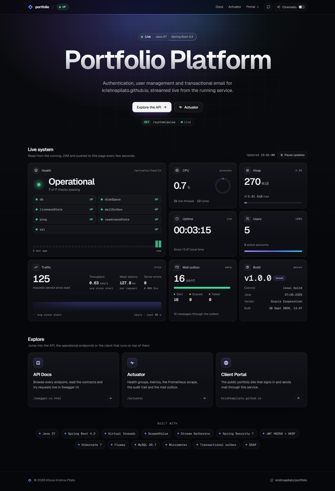
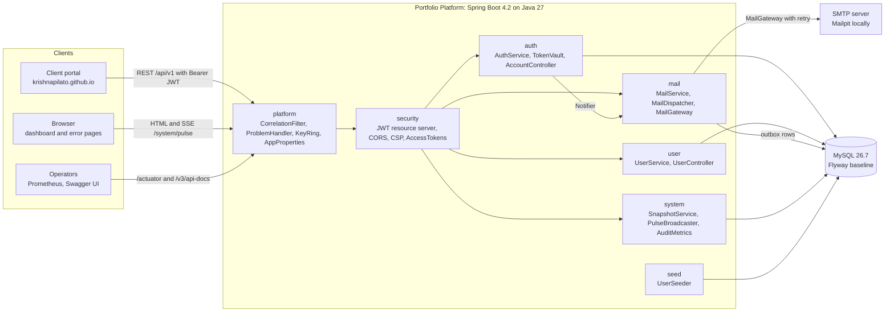
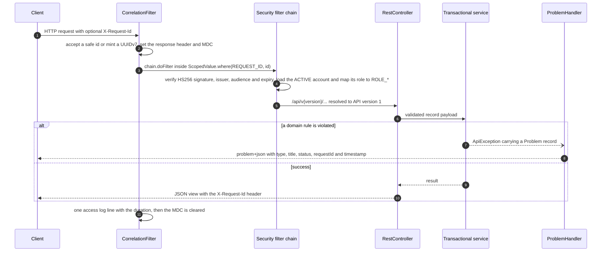
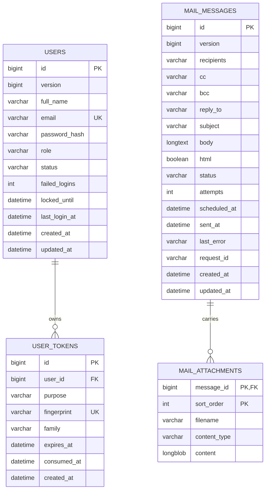
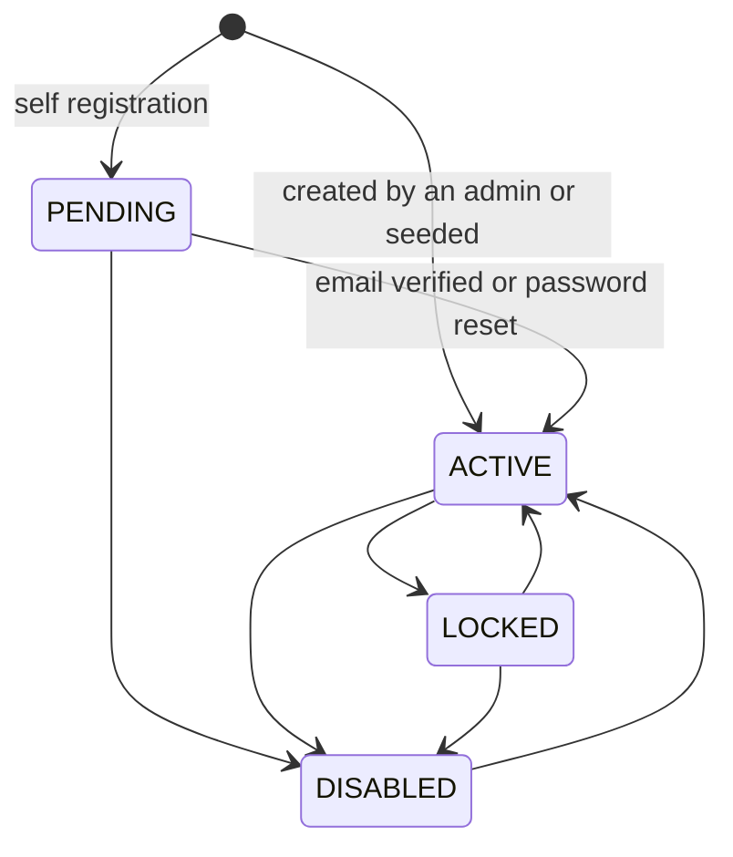
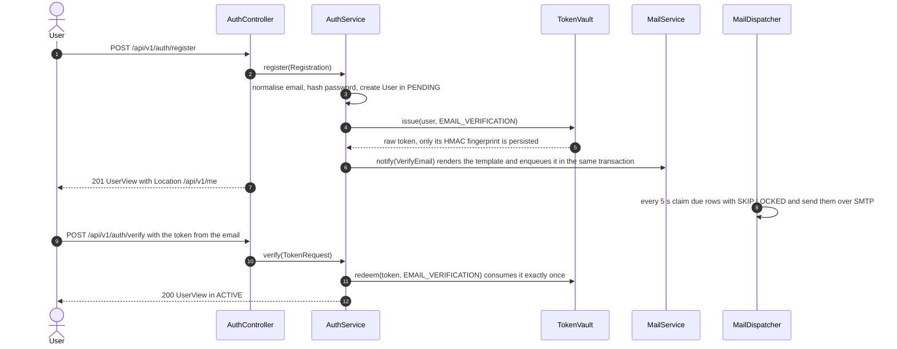
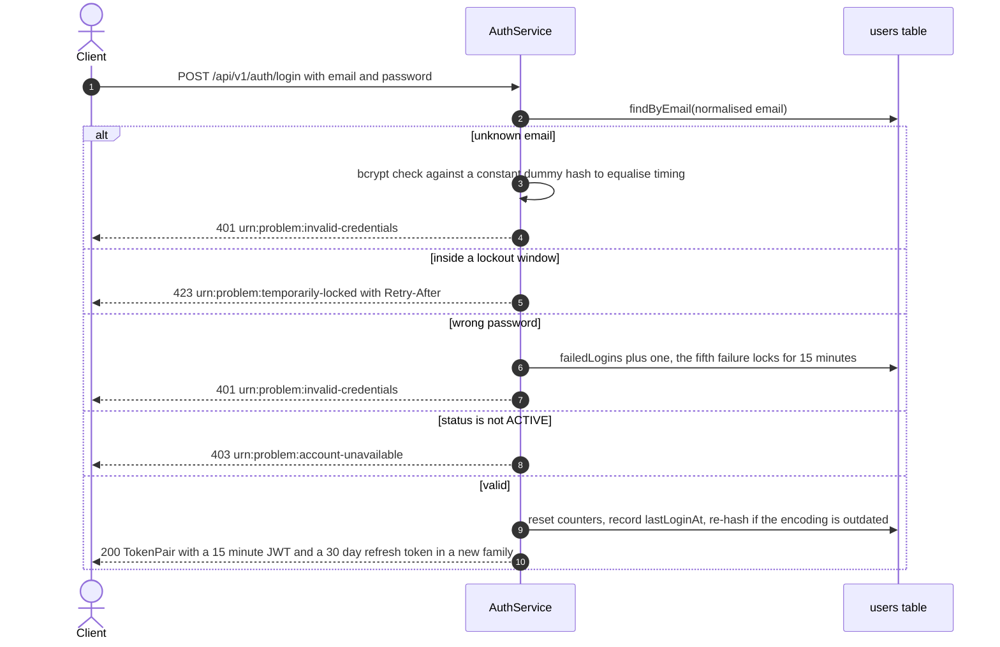
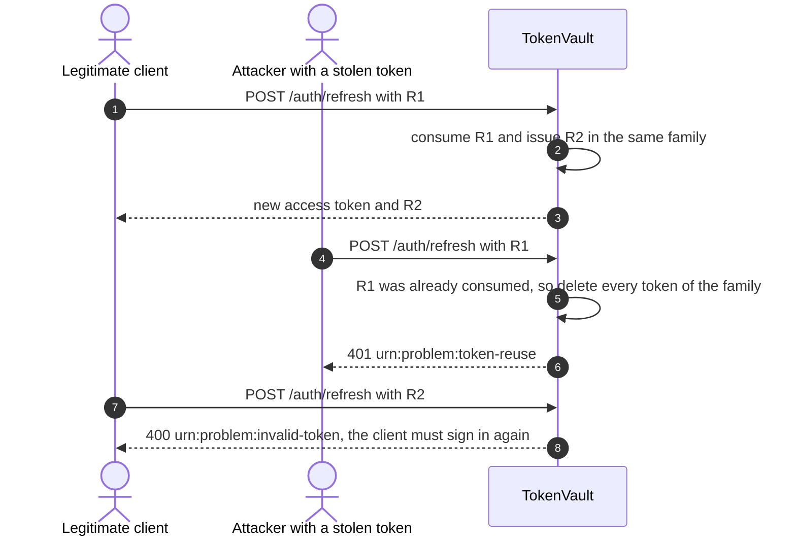
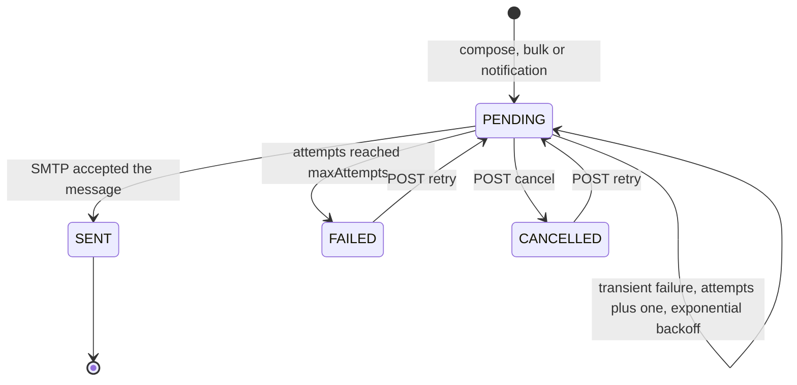

# Portfolio Platform

Backend for [krishnapilato.github.io/portfolio](https://krishnapilato.github.io/portfolio): authentication, user administration and transactional email, with a live system dashboard. It is a single Spring Boot 4.2 service on Java 27 that uses only final language features and is built to production standards: typed errors, a transactional outbox, refresh-token rotation with reuse detection, structured logs, metrics, health groups, a jlinked and AOT-cached container image, and a build that fails on any warning.

    

```bash
java launch.java
```

That one command (JDK 25 or newer plus Docker) builds the image, starts MySQL, Mailpit and the platform, waits for all three to report healthy, prints the URLs and the seeded admin credentials, and opens the dashboard.

## Screenshots


<p align="center">
  
  
</p>

The **live system dashboard** (`/`, top, with the Cinematic switch on) streams health, JVM, traffic, user, mail outbox and build figures over Server-Sent Events. **Error pages** (`templates/error.html`, bottom left) give every status a matching page with the request id ready to quote in a bug report. **Swagger UI** (`/swagger-ui.html`, bottom right) is generated by springdoc from the controllers, grouped by feature, with bearer-token authorization.

<details>
<summary>Full dashboard page</summary>



</details>

## Contents

- [Screenshots](#screenshots)
- [Highlights](#highlights)
- [Architecture](#architecture)
- [Request lifecycle](#request-lifecycle)
- [Domain model](#domain-model)
- [Authentication flows](#authentication-flows)
- [Transactional outbox](#transactional-outbox)
- [Java 27 feature map](#java-27-feature-map)
- [Security model](#security-model)
- [Observability](#observability)
- [Quality gates](#quality-gates)
- [Configuration](#configuration)
- [Running locally](#running-locally)
- [Production deployment](#production-deployment)
- [API reference](#api-reference)
- [Testing and coverage](#testing-and-coverage)
- [Continuous integration](#continuous-integration)
- [Project structure](#project-structure)
- [Design decisions and trade-offs](#design-decisions-and-trade-offs)

## Highlights

- **Typed error catalogue.** Every domain failure is a record in the sealed `Problem` interface. `ProblemHandler` maps it to an RFC 9457 `application/problem+json` response with one exhaustive `switch` over record patterns and no `default` branch. A new failure type does not compile until it has a status and a title.
- **Hardened authentication.** Access tokens are 15-minute HS256 JWTs whose authorities come from the account's current role and status in the database, so a demoted, disabled or deleted user loses access on the next request. Refresh tokens are opaque 256-bit values that are stored only as peppered HMAC fingerprints, rotated on every use and grouped into families, so replaying a used token revokes the whole family. Accounts lock temporarily after repeated failures, unknown emails cost the same bcrypt time as known ones, and the public authentication endpoints are rate limited per client.
- **One secret, many keys.** `KeyRing` uses the JDK 25 Key Derivation Function API (HKDF-SHA256) to derive independent keys for JWT signing and for token fingerprinting from a single `APP_SECRET`.
- **Transactional outbox for email.** Messages are written in the same transaction as the business change. A scheduled dispatcher claims due rows with `FOR UPDATE SKIP LOCKED`, which makes it safe to run several replicas. It delivers them concurrently on virtual threads with `Gatherers.mapConcurrent` and applies exponential backoff.
- **Request correlation with scoped values.** `CorrelationFilter` accepts or generates a UUIDv7 `X-Request-Id`. It binds the id to a `ScopedValue` and to the logging MDC, stamps it on every error response, and stores it on every queued email.
- **Operational depth.** ECS JSON logs, Prometheus metrics with an HTTP latency histogram, audit events and counters, liveness and readiness groups, a custom `outbox` actuator endpoint, a `mailOutbox` health indicator, the startup timeline, an SBOM, and build and git info (from the checkout in local builds, and from the `GIT_COMMIT` build argument in container images).
- **Live dashboard.** Server-rendered Thymeleaf pages in a dark bento layout, built with Open Props normalize, Geist, Tabler Icons and GSAP. The home page streams a system snapshot over Server-Sent Events every 3 seconds, and every error status gets a matching page. Motion follows the operating system: soft fades by default when reduced motion is requested, with a Cinematic switch for the full GSAP experience. No inline scripts are needed, so the Content Security Policy stays strict.
- **Lean, fast container.** Multi-stage build on Corretto 27 Alpine, a jlinked 53 MB runtime, Spring Boot layered extraction, and a JDK AOT cache that is trained during the build. In local measurements the cache serves 96 % of the roughly 20,000 classes loaded at startup and cuts context refresh time by about half. The image runs as a non-root user with a built-in health check.
- **Zero-warning build.** `javac -Xlint:all -Werror`, Error Prone with unused-code checks raised to errors, PMD unused-code rules, a JaCoCo gate of at least 80 % line, instruction and branch coverage (actual: 99.5 % lines, 98.7 % branches, printed at the end of every build), and PIT mutation testing gated at 90 % (actual: 100 % of mutants killed). Every package is `@NullMarked` with JSpecify. The code contains no comments: names, types and this document carry the explanation.

## Architecture

The service is a modular monolith organised by feature. Types are package-private unless another package needs them.



| Package | Responsibility |
|---|---|
| `platform` | Cross-cutting concerns: typed configuration (`AppProperties`), key derivation (`KeyRing`), correlation ids, the error model (`Problem`, `ApiException`, `ProblemHandler`, `ErrorPageAttributes`), pageable sort allow-lists (`Pageables`), enum tallies (`Tally`), and infrastructure beans (`Clock`, API versioning, OpenAPI, in-memory audit and HTTP exchange repositories). |
| `security` | The stateless security filter chain, JWT encoding and decoding, the database-backed role mapping, the Prometheus scrape chain, CORS, security headers and the `@StrongPassword` constraint. |
| `user` | The `User` aggregate, its account state machine, and the admin user management API. |
| `auth` | Registration, email verification, login, refresh, logout, password reset, per-client rate limiting of those endpoints, and the self-service account API. |
| `mail` | The outbox entity, rendering of Thymeleaf notifications, the admin mail API, the scheduled dispatcher, the SMTP gateway, and the outbox endpoint and health indicator. |
| `system` | The system snapshot, the SSE broadcaster, the dashboard controller and the audit metrics. |
| `seed` | Idempotent seeding of the admin and demo users from `seed/users.json`. |

## Request lifecycle



- **Versioning** uses Spring Framework 7's first-class API versioning. A `PathApiVersionResolver` reads the second path segment of `/api/v{version}/…`, controllers declare `version = "1"`, an unsupported version such as `/api/v2/…` is rejected with `400`, and paths outside `/api` carry no version. The literal `v` in the mapping also lets springdoc publish the real `/api/v1/…` paths.
- **Validation** uses Bean Validation on records, including container elements such as `List<@NotBlank @Email String>`. Failures return `400` with an `errors` map from field to message.
- **Transactions** are `readOnly` at class level for query-heavy services and read-write on commands. `AuthService` and `TokenVault` use `noRollbackFor = ApiException.class`, so failed-login counters, lockouts and refresh-family revocations are committed even though the request then fails.
- **Time** always comes from the injected `java.time.Clock`, which keeps expiry logic deterministic in tests.

## Domain model



- A single Flyway baseline (`V1__baseline.sql`) is portable across MySQL 26.7 and H2 2.5 in MySQL mode. Hibernate runs with `ddl-auto: validate`, so the entities and the schema can never drift silently.
- Entities are rich rather than anemic. `User` exposes intent-revealing methods (`register`, `transitionTo`, `verifyEmail`, `recordFailedLogin`, `recordSuccessfulLogin`, `changePassword`, `rename`, `assignRole`) instead of setters, and uses optimistic locking through `@Version`. The email is a `@NaturalId`, normalised with `strip().toLowerCase(Locale.ROOT)`.
- `MailMessage` stores recipient lists through an `AttributeConverter` and attachments as an ordered `@ElementCollection` of `@Embeddable` records.
- Grouped counts use JPQL constructor expressions into `Tally<K extends Enum<K>>`, zero-filled into an `EnumMap`, so statistics always list every status and role.

Account status is an explicit state machine, enforced by `AccountStatus.canTransitionTo` with an exhaustive `switch`:



`LOCKED` is an administrative decision. Brute-force protection is a separate, temporary `lockedUntil` window that expires on its own.

## Authentication flows

### Registration and email verification



### Login with lockout



### Refresh rotation and reuse detection



A refresh also requires the account to still be `ACTIVE`. Disabling or locking a user revokes all of that user's refresh tokens immediately, and every request made with one of the user's access tokens is rejected from then on, because the security filter chain loads the account behind each token. Password changes and resets revoke all refresh tokens, lift a brute-force lockout, and send a `PasswordChanged` notification. A password change also invalidates any pending reset link.

Verification and reset emails have a per-account cooldown (`app.security.email-cooldown`, 2 minutes). While a link issued within the cooldown is still unused, a repeated request sends nothing and keeps that link valid, so nobody can flood an inbox or keep replacing a victim's reset link. The links point at the frontend (`APP_FRONTEND_URL`), which must serve `/verify-email?token=…` and `/reset-password?token=…` and POST the token to `/api/v1/auth/verify` or `/api/v1/auth/password/reset`. The React site does not implement these pages yet; until it does, use the token printed in the email with those endpoints.

## Transactional outbox



1. `MailService` enqueues a `MailMessage` in the caller's transaction, together with the current request id. Notifications (`VerifyEmail`, `ResetPassword`, `PasswordChanged`) form a sealed interface. `NotificationRenderer` turns each one into a Thymeleaf template and subject with an exhaustive `switch`.
2. `MailDispatcher.dispatch()` runs every `app.mail.poll-interval` (default 5 s). It locks up to `batchSize` due rows with `PESSIMISTIC_WRITE` and `SKIP LOCKED`, snapshots them into immutable `Envelope` records, and delivers them with `stream().gather(Gatherers.mapConcurrent(concurrency, this::deliver))` on virtual threads.
3. Each delivery returns a sealed `Delivery` (`Sent` or `Failed`). The outcomes are applied on the transaction thread by an exhaustive `switch`: `markSent`, or `markFailed` with `scheduledAt = now + min(initialBackoff × 2^(attempts − 1), maxBackoff)`, which defaults to 30 s growing to at most 1 h, over 5 attempts.
4. `MailGateway.send` also carries a Spring Framework 7 `@Retryable` (2 retries, 200 ms delay with jitter, factor 2) for transient `MailSendException`s within one dispatch.
5. The `portfolio.mail.dispatched{outcome}` counter, the `outbox` actuator endpoint (statistics, plus a manual dispatch through a write operation) and the `mailOutbox` health indicator make the pipeline observable. The indicator reports `DOWN` when the oldest due message is older than `staleAfter` (15 min), which is the signature of a stuck dispatcher.

Delivery is **at least once**. A crash between the SMTP hand-off and the commit can resend a message, and that trade-off is preferable to losing a password-reset email.

## Java 27 feature map

Only final features are used. The code compiles with `--release 27` and no `--enable-preview`.

| Feature | Where | Why it earns its place |
|---|---|---|
| Sealed interfaces, record patterns and exhaustive `switch` (JEPs 409, 440, 441) | `Problem` in `ProblemHandler`, `Notification` in `NotificationRenderer`, `Delivery` in `MailDispatcher`, `AccountStatus.canTransitionTo`, `TokenPurpose.ttl` | The compiler proves every case is handled. Adding a problem type, a notification or a status breaks the build until every mapping is updated. |
| `case null, default` in pattern `switch` (JEP 441) | `ErrorPageAttributes` | `HttpStatus.Series.resolve` can return `null`, and the switch handles that explicitly. |
| Records (JEP 395) | All payloads, `AppProperties`, `Envelope`, `Attachment` (a JPA embeddable), `SystemSnapshot`, `Tally`, `IssuedToken`, `DispatchReport` | Immutable DTOs and value objects. Records that carry secrets override `toString()` to redact them. |
| Unnamed variables and patterns `_` (JEP 456) | Catch clauses, lambdas, `case Sent _`, `case Failed(_, var reason)` | Makes deliberate non-use explicit, which is also what Error Prone's `UnusedVariable` expects. |
| Stream Gatherers (JEP 485) | `Gatherers.mapConcurrent` in `MailDispatcher` | Bounded, order-preserving, cancel-on-failure fan-out on virtual threads without an executor to manage. |
| Scoped values (JEP 506) | `CorrelationFilter.REQUEST_ID` | Immutable per-request context that is readable from `ProblemHandler` and `MailService`, with no `ThreadLocal` leaks on pooled or virtual threads. |
| Flexible constructor bodies (JEP 513) | `ApiException` | Validates and assigns the `Problem` before `super(...)` builds a stackless exception. Domain errors are control flow, so they carry no stack trace. |
| Key Derivation Function API (JEP 510) | `KeyRing` | Uses HKDF-SHA256 to derive the JWT signing key and the token pepper from one master secret. |
| `UUID.ofEpochMillis` (JDK 26) | Request ids, refresh-token families, JWT `jti` | UUIDv7 values are time-ordered, so they are friendly to indexes and logs. |
| Virtual threads (JEP 444) | `spring.threads.virtual.enabled`, `mapConcurrent` | Blocking JDBC and SMTP code scales without reactive plumbing. |
| Sequenced collections (JEP 431) | `launch.java` (`getFirst()` on the link list and the process command) | States the intent to read the first element instead of indexing. |
| Pattern matching for `instanceof` (JEP 394) | `SecurityConfig` refines the `PasswordEncoder` to a `DelegatingPasswordEncoder` | Sets the bcrypt fallback for legacy hashes without an unchecked cast. |
| Text blocks (JEP 378) | The user search JPQL in `UserRepository`, the launcher usage text | Keeps multi-line strings readable. |
| Module imports, compact source files, instance `main` and `java.lang.IO` (JEPs 511, 512) | `launch.java` | A single-file launcher that runs with `java launch.java` and needs no build tool. It uses only APIs that are final in JDK 25, and CI compiles it with `javac --release 25`, so any JDK from 25 up can run it. |
| AOT cache (JEPs 483, 514, 515) | `Dockerfile` | Classes are loaded, linked and profiled ahead of time during the image build, which roughly halves startup work. |
| Compact object headers | Runtime | On by default in JDK 27: 8-byte object headers mean a smaller heap and better cache density at no cost. |

### Preview features deliberately not used

JDK 27 still ships these as preview features:

| Feature | Status in JDK 27 | Where it could fit | Why it is not used |
|---|---|---|---|
| Structured concurrency, `StructuredTaskScope` (JEP 533) | 7th preview | Snapshot fan-out, mail delivery | Its API changed again in 27 (three type parameters, new joiners, a new abstract `Joiner.timeout`). `Gatherers.mapConcurrent` provides bounded, cancelling virtual-thread fan-out through a final API. |
| Lazy constants, `LazyConstant`, `List/Map/Set.ofLazy` (JEP 531) | 3rd preview | The dummy bcrypt hash, rendered templates | Spring singletons and `static final` fields already give initialise-once semantics. The API was renamed from `StableValue` between previews. |
| Primitive types in patterns, and `switch` on `long` or `boolean` | Preview | Status-code switches | Switching on `int` constants is final and sufficient. |
| PEM encodings of cryptographic objects (JEP 538) | 3rd preview | Loading RSA or EC keys | Symmetric HS256 with an HKDF-derived key needs no PEM parsing. |

The general reasons:

- Preview class files (version `71.65535`) run only on exactly JDK 27 and only with `--enable-preview` at runtime.
- `-Xlint:all -Werror` rejects every use of a preview feature.
- Static analysis, coverage and IDE tooling lag behind preview APIs.
- Preview APIs change shape between releases.

A production codebase should not bind its runtime to a single feature release for syntax sugar.

## Security model

| Concern | Implementation |
|---|---|
| Authentication | OAuth 2.0 resource server with HS256 JWTs (`NimbusJwtEncoder` / `NimbusJwtDecoder`) that validate issuer, audience and expiry. The claims are `iss`, `aud`, `sub` (user id), `iat`, `exp`, `jti` (UUIDv7), `email`, `name` and `roles`. The `roles` claim is informational for clients: a database-backed converter loads the account by `sub` on every request, rejects the token with `401 invalid_token` unless the account exists and is `ACTIVE`, and grants the role stored in the database. The public `POST /api/*/auth/**` endpoints ignore any `Authorization` header, so a client that attaches an expired token can still refresh or sign in. |
| Keys | A single `APP_SECRET` (base64, at least 32 bytes) is expanded by HKDF-SHA256 into a signing key and a fingerprint pepper. Rotating it invalidates every access and refresh token at once. |
| Refresh, verification and reset tokens | 32 random bytes from `SecureRandom`, base64url encoded. Only `HMAC-SHA256(pepper, token)` is stored, so a database leak yields no usable token, while lookups stay indexed. Each token is single-use, expires, and is purged hourly. |
| Rotation and reuse | Each refresh consumes the token and issues a successor in the same family. Presenting a consumed token deletes the family and audits `TOKEN_REUSE`. |
| Passwords | A `DelegatingPasswordEncoder` with bcrypt, which re-hashes on login when the encoding is outdated. The `@StrongPassword` policy requires 10 to 72 characters (bcrypt's 72-byte limit, checked in UTF-8 bytes) with upper case, lower case and a digit. Seeded passwords must satisfy the same policy, or startup fails. |
| Brute force | After 5 consecutive failures the account is locked for 15 minutes, answered with `423` and `Retry-After`. Counters are committed even when the request fails, and a successful password reset or change lifts the lockout. Unknown emails cost one bcrypt check to prevent user enumeration by timing. |
| Rate limiting | `AuthRateLimiter` allows each client address `app.security.auth-requests-per-minute` (30) requests to `POST /api/*/auth/**` per fixed one-minute window and answers the rest with `429` and `Retry-After`. The address comes from `X-Forwarded-For` through `server.forward-headers-strategy: framework`, so the proxy in front must overwrite that header. The in-process limiter is a per-replica backstop: edge rate limiting at the ingress or WAF remains the primary control. |
| Enumeration | Resend verification and forgot password always answer `202`, including during the email cooldown. |
| Authorisation | Stateless sessions. `/api/*/users/**`, `/api/*/mail/**` and all actuator endpoints except health, info and the links index require `ROLE_ADMIN`. Everything else, unknown paths included, needs a token: API clients get a bare `401` bearer challenge, while browsers that accept `text/html` get the same `401` rendered as the HTML error page. `@EnableMethodSecurity` is on. |
| Last administrator | Admins cannot manage themselves (`SelfManagement`). Demoting, disabling, locking or deleting an active administrator locks the active administrators with `SELECT … FOR UPDATE` and is refused with `LastAdministrator` when none would remain, which also serialises concurrent cross-demotions. |
| Browser hardening | `Content-Security-Policy` allows scripts only from self and cdnjs. Also HSTS for 1 year including subdomains, `X-Frame-Options: DENY`, `frame-ancestors 'none'`, `Referrer-Policy: strict-origin-when-cross-origin`, and a `Permissions-Policy` that denies camera, microphone and geolocation. CDN assets carry Subresource Integrity hashes. |
| CORS | Origins come from `APP_CORS_ALLOWED_ORIGINS`. Allowed methods are `GET, POST, PUT, PATCH, DELETE, OPTIONS`. `X-Request-Id`, `Location` and `Retry-After` are exposed. Credentials are not allowed, which fits bearer tokens with no cookies (so CSRF protection is disabled by design). |
| Secrets hygiene | No defaults for sensitive properties, so the service fails fast without them. `.env` is git-ignored, and the launcher writes it with owner-only permissions where the file system supports POSIX. Logs contain user ids, never tokens or passwords. Payload records redact secrets in `toString()`. |

## Observability

- **Logs.** The `dev` profile uses readable console logs with `[requestId]` correlation. The `prod` profile writes structured ECS JSON with service name and environment. There is one access log line per request, except for assets, actuator, favicon and the SSE stream.
- **Correlation.** A valid inbound `X-Request-Id` (`[A-Za-z0-9._-]{8,64}`) is propagated, otherwise a UUIDv7 is generated. The id appears in the response header, the MDC, every problem response, the HTML error page (with a copy button) and each queued email.
- **Metrics.** Micrometer exports to Prometheus with an `application` tag and a percentiles histogram for `http.server.requests`. Custom metrics are `portfolio.mail.dispatched{outcome}` and `portfolio.audit.events{type}`.
- **Audit.** `USER_REGISTERED`, `EMAIL_VERIFIED`, `AUTHENTICATION_SUCCESS`, `AUTHENTICATION_FAILURE`, `ACCOUNT_LOCKED`, `TOKEN_REUSE`, `PASSWORD_RESET` and `PASSWORD_CHANGED` are published as `AuditApplicationEvent`s. They are kept in a bounded in-memory repository and counted by `AuditMetrics`.
- **Dashboard.** `/` renders a `SystemSnapshot` of health components, JVM, traffic, domain counters and build info. `/` and `/system/snapshot` share one snapshot for 2 seconds, so anonymous traffic triggers at most one capture every 2 seconds. `/system/pulse` streams a fresh snapshot every 3 seconds to at most 100 subscribers (further streams get `503` and the page polls instead), capturing it once per tick and only when someone is listening. If the database is unreachable, the snapshot keeps the last known domain counters and reports the `DOWN` status, so the dashboard shows the outage instead of failing. The page falls back to polling `/system/snapshot` if the stream fails, and labels the stream `stale` when no update arrives for 10 seconds.

| Endpoint | Access | Purpose |
|---|---|---|
| `/actuator` | Public | Links index |
| `/actuator/health`, `/actuator/health/liveness`, `/actuator/health/readiness` | Public (details for ADMIN) | Liveness has no dependencies. Readiness is `readinessState` plus `db`. Components also include `mailOutbox` and `diskSpace`. |
| `/actuator/info` | Public | App, build, git and Java info; OS and process info outside `prod` |
| `/actuator/prometheus` | `METRICS` (HTTP Basic) or ADMIN | Prometheus scrape endpoint |
| `/actuator/metrics` | ADMIN | Metric browser |
| `/actuator/outbox` | ADMIN | `GET` returns outbox statistics, `POST` triggers a dispatch |
| `/actuator/auditevents` | ADMIN | Security audit trail |
| `/actuator/httpexchanges` | ADMIN | The last 200 HTTP exchanges |
| `/actuator/startup` | ADMIN | Startup timeline (`BufferingApplicationStartup`, 4096 steps) |
| `/actuator/sbom` | ADMIN | CycloneDX SBOM (produced by online builds) |
| `/actuator/loggers` | ADMIN | Read and change log levels at runtime |
| `/actuator/env`, `/actuator/configprops` | ADMIN | Values shown to ADMIN only in `dev`, masked in every other profile |
| `/actuator/flyway`, `/actuator/scheduledtasks`, `/actuator/mappings`, `/actuator/beans`, `/actuator/conditions`, `/actuator/threaddump` | ADMIN | Diagnostics |
| `/actuator/heapdump` | ADMIN, `dev` profile only | Heap dump |

## Quality gates

Every Maven build, locally and in CI, enforces the following:

| Gate | Tool | Rule |
|---|---|---|
| Compiler | `javac --release 27 -Xlint:all,-processing -Werror` | Any lint warning fails the build, in main and test code. |
| Static analysis | Error Prone 2.50.0 | Every default warning fails the build. `UnusedVariable`, `UnusedMethod`, `UnusedNestedClass`, `UnusedLabel`, `UnusedTypeParameter`, `RemoveUnusedImports` and `WildcardImport` are raised to errors. |
| Unused code | PMD 7.28.0 (`config/pmd/unused-code.xml`) | Unused locals, private fields, private methods, formal parameters and assignments, plus unnecessary imports. Tests are included. It runs at `process-test-classes`. |
| Coverage | JaCoCo 0.8.15 | At least 80 % `LINE`, `INSTRUCTION` and `BRANCH` covered ratio for the bundle at `verify`. The totals are printed at the end of every build by `config/jacoco/CoverageSummary.java`, a Java 27 compact source file run by `exec-maven-plugin`. |
| Mutation testing | PIT 1.30.0 (`-Pmutation`) | At least 90 % of generated mutants must be killed. It is opt-in locally because it takes about 13 minutes, and runs as its own CI job. |
| Null safety | JSpecify | Every package is `@NullMarked`, and nullable values are annotated with `@Nullable` in type-use position. Spring Data 4 enforces this on repository parameters at runtime. |

Notes:

- Error Prone runs in the `error-prone` profile. The profile is active whenever the `idea.maven.embedder.version` property is absent, so every command-line and CI build runs it, while IntelliJ's Maven import keeps plain `javac -Werror` for fast incremental compilation.
- `.mvn/jvm.config` opens the `jdk.compiler` internals that Error Prone needs on JDK 27. It also allows `sun.misc.Unsafe` memory access, so Maven's own dependencies do not print warnings.
- Offline builds (`-o`) skip the CycloneDX SBOM. Online builds embed it for `/actuator/sbom`.

## Configuration

All configuration comes from environment variables. At startup the application also imports an optional `.env` file from the working directory (`spring.config.import: optional:file:${DOTENV_FILE:.env}[.properties]`), so IDE runs need no plugin. Copy `.env.example` to `.env`. `.env` is git-ignored. Set `DOTENV_FILE` to switch to another file, for example `DOTENV_FILE=staging.env`. The test suite points `DOTENV_FILE` at a file that does not exist, so a developer's local `.env` can never change test results.

Spring reads `.env` as a plain properties file, so its UPPER_SNAKE keys only feed the `${VAR}` placeholders in `application.yaml`. Profile selection and the relaxed `APP_*` overrides take effect only as real environment variables (Docker's `env_file` and `--env-file` count). In a `.env` used by IDE or Maven runs, write the property name instead, for example `app.security.max-failed-logins=10`.

| Variable | Example | Purpose |
|---|---|---|
| `SPRING_PROFILES_ACTIVE` | `prod` | Environment variable only, not read from `.env`. Unset means `dev`: debug logging, template reload, the heap dump endpoint, and `env` and `configprops` values visible to ADMIN. The container image and Compose set `prod`: ECS JSON logs, masked `env` and `configprops`, no OS or process info on `/actuator/info`, and content-hashed static assets served with a one-year public `Cache-Control`. |
| `PORT` | `8080` | HTTP port |
| `APP_FRONTEND_URL` | `https://krishnapilato.github.io/portfolio` | Base URL for the links in verification and reset emails. The frontend must serve `/verify-email?token=…` and `/reset-password?token=…` and POST the token to `/api/v1/auth/verify` and `/api/v1/auth/password/reset`. Defaults to the Vite dev server, `http://localhost:5173/portfolio`. |
| `APP_CORS_ALLOWED_ORIGINS` | `http://localhost:5173,https://krishnapilato.github.io` | Comma-separated CORS origins |
| `APP_SECRET` | `change-me` | **Required.** Base64 of at least 32 random bytes, for example from `openssl rand -base64 48`. |
| `APP_SCRAPE_PASSWORD` | | Password of the `prometheus` HTTP Basic user that may read only `/actuator/prometheus`. Empty disables it, leaving an ADMIN bearer token as the only way in. |
| `DB_URL` | `jdbc:mysql://localhost:3306/portfolio?createDatabaseIfNotExist=true` | **Required.** JDBC URL |
| `DB_USERNAME` | `root` | **Required.** Database user |
| `DB_PASSWORD` | `change-me` | **Required.** Database password. Docker Compose also uses it as the MySQL root password. |
| `MAIL_HOST` | `localhost` | **Required.** SMTP host |
| `MAIL_PORT` | `1025` | **Required.** SMTP port |
| `MAIL_USERNAME` | | SMTP user, empty for none |
| `MAIL_PASSWORD` | | SMTP password, empty for none |
| `MAIL_SMTP_AUTH` | `false` | Enable SMTP authentication |
| `MAIL_STARTTLS` | `false` | Enable STARTTLS |
| `MAIL_FROM` | `no-reply@portfolio.local` | **Required.** Sender address |
| `SEED_ENABLED` | `true` | Seed the admin and demo users on startup. Idempotent: existing emails are skipped. |
| `SEED_ADMIN_EMAIL` | `admin@portfolio.local` | Seeded administrator |
| `SEED_ADMIN_PASSWORD` | `change-me` | Administrator password. It must satisfy the password policy, or startup fails. |
| `SEED_DEMO_PASSWORD` | `change-me` | Password of the demo users `ada@portfolio.local` and `alan@portfolio.local`, under the same policy |

Optional overrides have safe defaults: `DB_POOL_SIZE` (10), `DB_CONNECTION_TIMEOUT` (5000 ms), `MAIL_POLL_INTERVAL` (`PT5S`) and `APP_JWT_ISSUER` (`portfolio`). Every other `app.*` property binds from an environment variable with Spring's relaxed rules (upper case, dots to underscores, dashes removed). For example, the environment variable `APP_SECURITY_MAXFAILEDLOGINS=10`, or the line `app.security.max-failed-logins=10` in `.env`, sets `app.security.max-failed-logins`.

| Property | Default | Property | Default |
|---|---|---|---|
| `app.security.audience` | `portfolio-api` | `app.mail.sender` | `Portfolio` |
| `app.security.access-token-ttl` | `15m` | `app.mail.batch-size` | `25` |
| `app.security.refresh-token-ttl` | `30d` | `app.mail.concurrency` | `8` |
| `app.security.verification-ttl` | `24h` | `app.mail.max-attempts` | `5` |
| `app.security.password-reset-ttl` | `1h` | `app.mail.initial-backoff` | `30s` |
| `app.security.max-failed-logins` | `5` | `app.mail.max-backoff` | `1h` |
| `app.security.lockout` | `15m` | `app.mail.stale-after` | `15m` |
| `app.security.email-cooldown` | `2m` | `app.security.auth-requests-per-minute` | `30` |

`AppProperties` is a validated record tree (`@Validated`, `@NotBlank`, `@Email`, `@Min`), so a misconfiguration stops the application at startup with a precise message instead of failing at the first request.

## Running locally

### 1. One-command launcher

Requirements: JDK 25 or newer, and Docker with Compose v2.

```bash
java launch.java
java launch.java status
java launch.java logs
java launch.java down
```

`up`, the default command, does the following:

1. Checks `docker info` and `docker compose version`.
2. Finds the project. It looks in the current directory, then `./backend/java`, then `./portfolio-main/backend/java`. If none of these exists, it downloads the repository archive with `HttpClient` and extracts only `backend/java`, rejecting any entry that would escape the target directory (zip-slip).
3. Creates `.env` from `.env.example`, replacing every `change-me` with a freshly generated secret: a 48-byte base64 `APP_SECRET`, and 20-character passwords that satisfy the password policy. It refuses to start with an unusable `APP_SECRET`.
4. Runs `docker compose up --build --detach --wait`.
5. Prints the URLs and the seeded admin credentials, then opens the browser.

Exit codes propagate. Colours are used only on an interactive console and never when `NO_COLOR` is set.

| URL | What |
|---|---|
| http://localhost:8080 | Live dashboard |
| http://localhost:8080/swagger-ui.html | OpenAPI documentation. Use **Authorize** with a token from `/api/v1/auth/login`. |
| http://localhost:8080/actuator | Actuator index |
| http://localhost:8025 | Mailpit inbox, where every email the platform sends appears |

### 2. Docker Compose

```bash
cp .env.example .env
openssl rand -base64 48
docker compose up --build --wait
```

Before `up`, put the generated value into `APP_SECRET` and choose real passwords in `.env`. The stack consists of:

- `mysql`: MySQL 26.7. A named volume keeps the data, and the database is published on host port `3307` so that it never clashes with a local MySQL.
- `mailpit`: SMTP on `1025`, web UI on `8025`.
- `app`: built from the `Dockerfile` and run with the `prod` profile.

Each service has a health check, and the app starts only after MySQL and Mailpit are healthy.

### 3. IDE or Maven

```bash
docker compose up --detach --wait mysql mailpit
./mvnw spring-boot:run
```

- Point `.env` at the Compose database: `DB_URL=jdbc:mysql://localhost:3307/portfolio`, with the same `DB_PASSWORD`. Keep `MAIL_HOST=localhost` and `MAIL_PORT=1025`.
- In IntelliJ IDEA, run `PortfolioApplication` with the working directory `backend/java`, and the `.env` file is picked up automatically. IntelliJ's Maven import deliberately skips the Error Prone profile. Run `./mvnw verify` before pushing to get the full gate set.
- On Windows, use `mvnw.cmd`. On Unix-like systems, if the checkout lost the executable bit, use `sh ./mvnw`.

### Troubleshooting

| Symptom | Fix |
|---|---|
| `APP_SECRET must be base64 encoding at least 32 random bytes` | Generate a secret with `openssl rand -base64 48`, or delete `.env` and rerun the launcher. |
| The app container is unhealthy after `DB_PASSWORD` changed | MySQL keeps the root password from its first start. Reset the volume with `docker compose down -v`. |
| Port already in use | Free `8080`, `8025`, `1025` or `3307`, or change the published ports in `compose.yaml`. |
| `Seed password for ... does not satisfy the password policy` | Set `SEED_ADMIN_PASSWORD` and `SEED_DEMO_PASSWORD` to 10 to 72 characters with upper case, lower case and a digit, or delete `.env` and rerun the launcher. |

## Production deployment

### Container image

```bash
docker build --build-arg GIT_COMMIT="$(git rev-parse HEAD)" -t portfolio .
docker run --detach --name portfolio --publish 8080:8080 --env-file prod.env -e SPRING_PROFILES_ACTIVE=prod portfolio
```

`prod.env` must hold production values: `DB_URL` and `MAIL_HOST` have to be reachable from inside the container, because the `localhost` of `.env.example` points at the container itself. `-e` wins over `--env-file`, so the container runs the `prod` profile whatever the file says.

| Stage | What happens | Why |
|---|---|---|
| Build on `amazoncorretto:27-alpine3.24` | `sh ./mvnw dependency:go-offline` runs before `src` is copied, both with a BuildKit cache mount on `/root/.m2`. Then `package` runs with tests, JaCoCo, PMD and the git plugin skipped, because CI already enforced them and the build context has no `.git`. A `GIT_COMMIT` build argument, if given, is written to `git.properties`. | Dependency resolution is cached across builds, and code-only changes rebuild quickly. `sh ./mvnw` works even when a Windows checkout dropped the executable bit. |
| Layered extraction | `java -Djarmode=tools -jar target/portfolio.jar extract --layers` | Dependencies, loader, snapshot dependencies and application are copied as separate image layers, ordered from least to most frequently changing. |
| jlink | 23 modules with `--strip-debug --no-man-pages --no-header-files --compress=zip-6`, giving a runtime of about 53 MB | The module list is the output of `jdeps --print-module-deps`, plus modules that are loaded as services or by reflection (charsets, DNS naming, zipfs, management, `jdk.net`). `jdk.crypto.ec` is left out: since JDK 22 SunEC lives in `java.base`, and the module is an empty shell. |
| Runtime on `alpine:3.24` | Non-root `app` user, `SPRING_PROFILES_ACTIVE=prod`, `EXPOSE 8080`, and a `HEALTHCHECK` on `/actuator/health/liveness` using busybox `wget` | Small attack surface. Orchestrators and `docker compose --wait` can see the container's health. |
| AOT cache training | The image starts the application once with `-XX:AOTCacheOutput=app.aot -Dspring.context.exit=onRefresh`, using DB-less settings: Flyway off, no JDBC metadata access, an explicit dialect, and throwaway credentials. | The JVM records the loaded and linked classes and method profiles into `app.aot`. |

JVM options live in a launcher argument file, `/app/jvm.options`, used by `ENTRYPOINT ["java", "@jvm.options", "-jar", "portfolio.jar"]`:

- `-XX:MaxRAMPercentage=75` sizes the heap from the container memory limit.
- `-XX:+ExitOnOutOfMemoryError` lets the orchestrator restart a broken JVM instead of leaving it limping.
- `-XX:AOTCache=app.aot` is appended **only if** training succeeded. A failed training therefore never breaks a local build, nor makes the JVM log errors about a missing cache at runtime. CI builds with `AOT_REQUIRED=true`, where a failed training fails the image job.

The training and the runtime read the same file, so their flags cannot drift. Training also uses `-XX:+AOTCompatibleOopCompression`, which makes the cache valid for any heap size: the build host usually has more memory than the container, and without this flag a compressed-oops mismatch would silently disable the AOT code cache. JDK 27 selects G1 even for 1 CPU / 1 GB containers, so the garbage collector used at build time matches the one used at runtime. Add further flags with `JAVA_TOOL_OPTIONS`.

The runtime stage runs `java -jar` on the extracted jar instead of Spring Boot's `JarLauncher`. The deciding factor is the AOT cache. With `--launcher` extraction and `JarLauncher`, only 83 % of classes (73 % of Spring's) are served from the cache. With the plain extraction and the application class loader, the figure is 96 % (99 % of Spring's).

### Runtime checklist

- **Required environment:** `APP_SECRET`, `DB_URL`, `DB_USERNAME`, `DB_PASSWORD`, `MAIL_HOST`, `MAIL_PORT`, `MAIL_FROM`. Sensitive values have no defaults, so the service refuses to start without them.
- **Probes:**

  ```yaml
  livenessProbe:
    httpGet:
      path: /actuator/health/liveness
      port: 8080
  readinessProbe:
    httpGet:
      path: /actuator/health/readiness
      port: 8080
  ```

- **TLS:** terminate TLS at the load balancer or ingress. `server.forward-headers-strategy: framework` honours `X-Forwarded-*`, so redirects, `Location` headers and links use the public scheme and host.
- **Logs:** ECS JSON on stdout. Ship them with any ECS-aware collector and filter by `requestId`.
- **Metrics:** scrape `/actuator/prometheus` with HTTP Basic `prometheus` / `APP_SCRAPE_PASSWORD` (`basic_auth.password_file` in Prometheus). That user can read nothing else. An ADMIN bearer token also works.
- **Abuse control:** put edge rate limiting in front of `/api/v1/auth/**`. The in-process limiter and the email cooldown are backstops, and the proxy must overwrite `X-Forwarded-For` so clients cannot choose their own address.
- **Database:** Flyway migrates on startup and Hibernate validates the schema. Use a dedicated user with DDL rights for migrations, or run them as a separate step.
- **Scaling:** access tokens are stateless and outbox dispatch uses `SKIP LOCKED`, so replicas can run side by side. Audit events and HTTP exchanges are held in memory per instance. Route them to a persistent store if they must survive restarts.
- **Secret rotation:** rotating `APP_SECRET` signs everyone out, because both derived keys change.

## API reference

Interactive documentation lives at `/swagger-ui.html`, and the OpenAPI document at `/v3/api-docs`. All API paths are versioned with `/api/v1`.

### Authentication (`/api/v1/auth`, public)

| Method | Path | Body | Response |
|---|---|---|---|
| `POST` | `/register` | `Registration` | `201 UserView` with `Location: /api/v1/me`. The user starts `PENDING`, and a verification email is queued. |
| `POST` | `/verify` | `TokenRequest` | `200 UserView`. The user moves from `PENDING` to `ACTIVE`. |
| `POST` | `/verify/resend` | `EmailRequest` | `202` always. A pending user gets a new token and older ones are revoked, unless a link issued within the email cooldown is still unused. |
| `POST` | `/login` | `Credentials` | `200 TokenPair` |
| `POST` | `/refresh` | `RefreshRequest` | `200 TokenPair`, rotated within the same family |
| `POST` | `/logout` | `RefreshRequest` | `204`. The family is revoked. An unknown token also gets `204`. |
| `POST` | `/password/forgot` | `EmailRequest` | `202` always. Existing pending or active users get a reset email, unless a link issued within the email cooldown is still unused. |
| `POST` | `/password/reset` | `PasswordReset` | `204`. The password changes, a pending user is activated, a brute-force lockout is lifted, all refresh tokens are revoked, and a notification is sent. |

Every endpoint in this group answers `429` with `Retry-After` once a client exceeds the per-minute limit.

### Account (`/api/v1/me`, authenticated)

| Method | Path | Body | Response |
|---|---|---|---|
| `GET` | `` | | `200 UserView` |
| `PATCH` | `` | `ProfileUpdate` | `200 UserView` |
| `PUT` | `/password` | `PasswordChange` | `204`. All refresh tokens and pending reset links are revoked, a brute-force lockout is lifted, and a notification is sent. |
| `DELETE` | `/sessions` | | `204`. All refresh tokens are revoked. |

### Users (`/api/v1/users`, ADMIN)

| Method | Path | Response |
|---|---|---|
| `GET` | `?q=&role=&status=&page=&size=&sort=` | `200` page of `UserView`. Sortable by `createdAt`, `updatedAt`, `fullName`, `email`, `lastLoginAt`, `status`, `role`. The default sort is `createdAt,desc` with 20 per page (at most 100). |
| `GET` | `/stats` | `200 UserStats` with totals, zero-filled by status and by role |
| `GET` | `/{id}` | `200 UserView` |
| `POST` | `` | `201 UserView` with `Location`. The user is created `ACTIVE`. A duplicate email returns `409`. |
| `PATCH` | `/{id}` | `200 UserView`. An admin cannot change their own role, nor demote the last active administrator. |
| `PUT` | `/{id}/status` | `200 UserView`. The state machine applies, leaving `ACTIVE` revokes the user's refresh tokens, and the user's access tokens stop working immediately. The last active administrator cannot be locked or disabled. |
| `DELETE` | `/{id}` | `204`. An admin cannot delete themselves or the last active administrator. The user's tokens go with the account through `ON DELETE CASCADE`. |

### Mail (`/api/v1/mail`, ADMIN)

| Method | Path | Response |
|---|---|---|
| `POST` | `/messages` with JSON `ComposeRequest` | `202 MailView` with `Location`. Up to 10 addresses each in to, cc and bcc, plus an optional future `sendAt`. |
| `POST` | `/messages` as `multipart/form-data` | `202 MailView`. The part `message` holds the JSON `ComposeRequest`, and up to 5 `attachments` parts hold files of at most 10 MB each (25 MB per request). |
| `POST` | `/messages/bulk` | `202 BulkReceipt`. One message per recipient, up to 500, so recipients never see each other. |
| `GET` | `/messages?status=&page=&size=&sort=` | `200` page of `MailView`. Sortable by `createdAt`, `scheduledAt`, `status`. The default sort is `createdAt,desc`. |
| `GET` | `/messages/{id}` | `200 MailView` |
| `POST` | `/messages/{id}/retry` | `200 MailView`. Allowed for `FAILED` or `CANCELLED`, otherwise `409`. |
| `POST` | `/messages/{id}/cancel` | `200 MailView`. Allowed for `PENDING`, otherwise `409`. |
| `GET` | `/stats` | `200 OutboxStats` with counts by status and the oldest due timestamp |

### Pages and system (public)

| Method | Path | Response |
|---|---|---|
| `GET` | `/` | Live dashboard (HTML) with health, CPU, heap, uptime, traffic, users, mail outbox and build cards |
| `GET` | `/system/snapshot` | `200 SystemSnapshot` |
| `GET` | `/system/pulse` | `text/event-stream` of `snapshot` events |
| any | unmapped path | An HTML error page for browsers, and a JSON error body with `requestId` for API clients. Anonymous requests are answered `401` before routing, so they never learn whether a path exists |

The pages share one design: a near-black canvas with a faded grid and soft indigo and cyan spotlights, Geist for text, tabular figures for numbers, Geist Mono for ids and paths, and hairline cards in a bento grid (four columns on desktop, two on tablets, one on phones).

- **Dashboard.** The page is fully rendered on the server, so it works without JavaScript. `home.js` then opens `/system/pulse` and updates every card in place: numbers tween to the new value, the health strip adds a beat, and the traffic card draws requests per second against the average since start. If the stream fails it falls back to polling `/system/snapshot` every 5 seconds and retries the stream every minute. A **Pause updates** button stops the stream.
- **Error pages.** A large status code tinted by class (amber for 4xx, indigo for 401 and 403, red for 5xx), the reason, a hint, links home and to the API docs, and a diagnostics card with the path, the request id (with a copy button) and the time in the viewer's time zone.

Motion is handled by `motion.js`, which both pages share:

| Mode | When | What moves |
|---|---|---|
| Soft | Default when the operating system asks for reduced motion (on Windows, *Animation effects* off) | Opacity fades of 240 ms or less and numbers counting to their value. Nothing translates, scales, rotates, blurs or scrolls. |
| Cinematic | Default otherwise, or when the **Cinematic** switch in the top bar is on | The full GSAP intro (masked headline letters, scrambled subtitle, cascading cards), a count-up and a highlight on every live update, cursor-following glows, card tilt, magnetic buttons, a scrolling technology band and scroll reveals. Error codes glitch in and flicker now and then. |

The switch is a real button with `aria-pressed`, and the choice is stored per browser in `localStorage` (`portfolio.motion`). An explicit choice wins over the system setting, so people who turned animations off for comfort get a calm page by default but can still opt in. The OS setting is respected because large motion can trigger vestibular discomfort. If the animation library cannot load, the page stays in soft mode and the switch is disabled with an explanation.

### Error model

Every API error is an RFC 9457 problem detail. Its `type` is a stable URN derived from the `Problem` record name.

```json
{
  "type": "urn:problem:temporarily-locked",
  "title": "Account temporarily locked",
  "status": 423,
  "detail": "Too many failed sign-in attempts; try again later",
  "instance": "/api/v1/auth/login",
  "lockedUntil": "2026-09-30T10:15:00Z",
  "requestId": "0199a3f4-6c1e-7a52-9f0b-3c5d2e8a1b47",
  "timestamp": "2026-09-30T10:00:00Z"
}
```

| `type` | Status |
|---|---|
| `urn:problem:not-found` | 404 |
| `urn:problem:email-taken` | 409 |
| `urn:problem:invalid-credentials` | 401 |
| `urn:problem:account-unavailable` | 403 |
| `urn:problem:temporarily-locked` | 423 with `Retry-After` and `lockedUntil` |
| `urn:problem:invalid-token` | 400 |
| `urn:problem:token-reuse` | 401 |
| `urn:problem:illegal-transition` | 409 |
| `urn:problem:self-management` | 409 |
| `urn:problem:last-administrator` | 409 |
| `urn:problem:rate-limited` | 429 with `Retry-After` |
| `urn:problem:wrong-password` | 400 |
| `urn:problem:unsupported-sort` | 400 with `allowed` |
| `urn:problem:mail-not-modifiable` | 409 |

Framework errors use the same shape: `400` with an `errors` field map for validation failures, `409` for integrity conflicts and optimistic-lock collisions, `403` for access denied, and `500` for anything unexpected, which is logged without leaking details. The HTML error page and the `/error` JSON show the exception message only for `4xx` statuses, never for server errors.

## Testing and coverage

```bash
./mvnw verify
```

- `verify` compiles with every gate, runs the tests, and enforces the JaCoCo rule. It ends with a coverage table like this one:

  ```text
  [coverage] JaCoCo totals (gate: LINE, BRANCH, INSTRUCTION >= 80%)
  [coverage]   INSTRUCTION    99.6%  PASS  (6438 of 6462 covered)
  [coverage]   BRANCH         98.7%  PASS  (229 of 232 covered)
  [coverage]   LINE           99.5%  PASS  (1095 of 1101 covered)
  [coverage]   METHOD        100.0%  PASS  (373 of 373 covered)
  [coverage]   CLASS         100.0%  PASS  (99 of 99 covered)
  ```

  The browsable HTML report, with per-package, per-class and per-line detail, is written to `target/site/jacoco/index.html`. It is regenerated by every `verify` and removed by `clean`.
- The 80 % gate is a floor, not a target: a floor near 100 % invites tests written to hit a number. The remaining uncovered branches are unreachable by design, such as the `false` path of an `instanceof` check that cannot fail, and a javac-generated default in an exhaustive `switch`.
- Coverage shows that code ran, not that a test would notice a bug. Mutation testing measures that directly:

  ```bash
  ./mvnw -Pmutation verify
  ```

  PIT injects small faults (flipped comparisons, removed calls, negated conditions, altered return values) and reruns the tests covering each one. The build fails if fewer than 90 % of the mutants are killed. The current suite kills all of them. The report is written to `target/pit-reports/index.html`. Surviving mutants were treated as design feedback rather than suppressed: two equivalent conditionals became `Math.min` and the JDK 26 `Comparator.min`, a premature `ClassValue` cache was removed, and the admin audit log lines became tested behaviour.
- Tests run under the `test` profile on H2 2.5 in MySQL mode, against the same Flyway baseline, with `ddl-auto: validate`. Mapping mistakes therefore fail the same way they would on MySQL.
- The scheduled mail poll and dashboard pulse are stretched to 24 hours in tests, so tests drive dispatch explicitly and deterministically. Seeded users provide real administrators for authorisation scenarios.
- The suite covers:
  - Repository slices (`@DataJpaTest`).
  - Web and security behaviour through `MockMvcTester` with real JWTs.
  - End-to-end flows: registration, verification by email, login, refresh rotation and reuse detection, lockout, password reset, admin user management, mail compose (JSON and multipart), bulk, retry, cancel and outbox dispatch.
  - Exhaustive `Problem` to HTTP mapping.
- Mockito is attached as a Java agent at startup instead of being loaded dynamically, which JDK 21 and later warn about (JEP 451). The `mockito.agent` property builds the jar path from `${settings.localRepository}` and the Boot-managed `${mockito.version}`, so it resolves the same way in Maven, in CI and in IntelliJ's test runner.

## Continuous integration

`.github/workflows/backend.yml` at the repository root runs on pushes to `main` and on pull requests that touch `backend/java/**` or the workflow itself, and on manual dispatch:

| Job | Steps |
|---|---|
| `verify` | Oracle JDK 27 through `actions/setup-java` with a Maven cache. It compiles `launch.java` with `javac --release 25 -Xlint:all -Werror`, then runs `sh ./mvnw -B -ntp verify` (all gates and tests). The JaCoCo report is uploaded as an artifact. |
| `mutation` | Needs `verify`. Runs PIT with the `mutation` profile and fails below a 90 % mutation score. The PIT report is uploaded as an artifact. |
| `image` | Needs `verify`. Builds the Docker image with Buildx and the GitHub Actions layer cache, using `AOT_REQUIRED=true`, `GIT_COMMIT` and an `org.opencontainers.image.revision` label set to the commit. A jlinked runtime that cannot refresh the Spring context, or a failed AOT training, therefore fails the job. The image is not pushed. |

## Project structure

```text
backend/java
├── Dockerfile
├── compose.yaml
├── launch.java
├── .env.example
├── config
│   ├── pmd/unused-code.xml
│   └── jacoco/CoverageSummary.java
├── docs/screenshots   home.png, home-full.png, error-404.png, swagger.png
├── pom.xml
└── src
    ├── main
    │   ├── java/com/personal/portfolio
    │   │   ├── PortfolioApplication.java
    │   │   ├── platform   AppProperties, KeyRing, PlatformConfig, CorrelationFilter, Pageables, Tally,
    │   │   │              Problem, ApiException, ProblemHandler, ErrorPageAttributes
    │   │   ├── security   SecurityConfig, AccessTokens, StrongPassword
    │   │   ├── user       User, Role, AccountStatus, UserRepository, UserService, UserController, UserPayloads
    │   │   ├── auth       UserToken, TokenPurpose, UserTokenRepository, TokenVault, AuthService, AuditType,
    │   │   │              AuthRateLimiter, AuthController, AccountController, AuthPayloads
    │   │   ├── mail       MailMessage, Attachment, MailStatus, MailRepository, AddressListConverter, Envelope,
    │   │   │              MailAddress, Notification, Notifier, NotificationRenderer, MailService, MailGateway,
    │   │   │              MailDispatcher, MailController, MailPayloads, MailOutboxEndpoint,
    │   │   │              MailOutboxHealthIndicator
    │   │   ├── system     SystemSnapshot, SnapshotService, PulseBroadcaster, HomeController, AuditMetrics
    │   │   └── seed       UserSeeder
    │   └── resources
    │       ├── application.yaml
    │       ├── db/migration/V1__baseline.sql
    │       ├── seed/users.json
    │       ├── templates  home.html, error.html, mail/verify-email.html, mail/reset-password.html,
    │       │              mail/password-changed.html
    │       └── static     favicon.svg, assets/app.css, assets/motion.js, assets/home.js, assets/error.js
    └── test
        ├── java/com/personal/portfolio
        └── resources/application-test.yaml
```

## Design decisions and trade-offs

- **Modular monolith over microservices.** Authentication, users and mail share one transactional boundary, so a user and their verification email are committed atomically without distributed coordination. The feature packages are cut so that they could be extracted later.
- **Symmetric HS256 over RS256 with JWKS.** The service is the only issuer and the only resource server, so a derived symmetric key is simpler and faster. If other services ever need to verify tokens, switch to an asymmetric key pair and publish a JWKS under `/.well-known`, which the security configuration already leaves open.
- **Opaque, fingerprinted refresh tokens over JWT refresh tokens.** Refresh tokens must be revocable and single-use, which requires server state. Storing a peppered HMAC rather than a bcrypt hash keeps lookups indexable, while a database dump reveals nothing usable.
- **Family-based rotation.** This follows the OAuth 2.0 Security Best Current Practice: reuse of a consumed refresh token is treated as theft and ends every session in that family.
- **Committed failures.** `noRollbackFor = ApiException.class` is deliberate: security bookkeeping (failed attempts, lockouts, revocations) must survive the exception that reports it.
- **Outbox with at-least-once delivery over sending inside the request.** Requests never block on SMTP, and mail survives SMTP outages and restarts. A rare duplicate email is the accepted cost.
- **A locked count for the "last admin" invariant.** Admins cannot manage themselves, and any change that would take away an active administrator's rights locks the active administrator rows first and refuses to remove the last one. The lock serialises concurrent cross-demotions, which a self-management rule alone cannot prevent.
- **Database-checked access tokens.** The resource server loads the account behind each token (one primary-key lookup per authenticated request), so role changes, disabling, locking and deletion apply to outstanding access tokens immediately, and the design stays horizontally scalable over the shared database. A password change or an explicit end of sessions revokes refresh tokens immediately, while an access token already issued to an `ACTIVE` account stays valid until its 15-minute expiry.
- **Sealed hierarchies over exception class trees.** One exception type carries a sealed `Problem`, and one exhaustive `switch` owns the HTTP mapping. The compiler keeps the catalogue complete.
- **Final features only.** See [Preview features deliberately not used](#preview-features-deliberately-not-used).
- **Comment-free source.** Intent is expressed through names, types, records and small methods. The static analysis gates make dead code impossible, and this README is the single narrative document.
- **H2 in MySQL mode for tests over Testcontainers.** Tests are fast, need no Docker, and run the real migration. The trade-off is that MySQL-specific locking and collation are exercised less faithfully. The real MySQL path (Flyway on MySQL 26.7 and InnoDB locking) is exercised by the Compose stack (`docker compose up --build --wait` or `launch.java`), not in CI.
- **A Spring Boot milestone (4.2.0-M2).** It brings first-class API versioning, JSpecify-aware Spring Data, Jackson 3 and the Spring Framework 7 resilience annotations, in exchange for tracking a pre-GA release.
- **AOT cache over GraalVM native image.** The service keeps the full JIT, a normal debugging experience and unrestricted reflection, and still gets a large part of the startup win, with no build-time closed-world constraints.

## License

MIT © Khova Krishna Pilato
